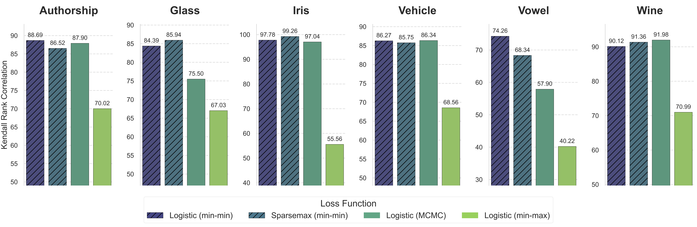

class: middle, center, title-slide

$$
\gdef\muv{\bm{\mu}}
\gdef\thetav{\bm{\theta}}
\gdef\u{{\bm{u}}}
\gdef\U{{\bm{U}}}
\gdef\v{{\bm{v}}}
\gdef\w{{\bm{w}}}
\gdef\x{{\bm{x}}}
\gdef\y{\bm{y}}
\gdef\cC{\mathcal{C}}
\gdef\cF{\mathcal{F}}
\gdef\cL{\mathcal{L}}
\gdef\cB{\mathcal{B}}
\gdef\cP{\mathcal{P}}
\gdef\cV{\mathcal{V}}
\gdef\cW{\mathcal{W}}
\gdef\cX{\mathcal{X}}
\gdef\cY{\mathcal{Y}}
\gdef\RR{\mathbb{R}}
\gdef\EE{\mathbb{E}}
\gdef\LSE{{\mathrm{LSE}}}
$$

# Joint Learning of Energy-based Models and their Partition Function

  
Michaël Sander, Vincent Roulet, Tianlin Liu, Mathieu Blondel

---

# Outline

* What are energy-based models? (EBMs)
* Inference with EBMs
* Existing approaches for learning EBMs
* Proposed learning approach
* Experiments

---

{{OUTLINE}}

---

## Problem setup: probabilistic structured prediction

.center[**Goal:** learn a conditional probability distribution $p(\y|\x)$ over $\cY|\cX$]

$\cX$: input space  
$\cY$: combinatorially-large discrete output space
--

 

**Examples**

* Multi-label classification: $\cY$ is the power set of $[k]$, with $|\cY| = 2^k$
* Label ranking: $\cY$ is the set of permutations of $[k]$, with $|\cY| = k!$

.grid[
.kol-1-2.left.width-90[
 
]
.kol-1-2.center.width-90[

]
]

---

## Probabilistic energy-based models (EBMs)

Turn a function into a probability distribution without factorization assumptions.
$$
p\_g(\y|\x) \coloneqq \frac{q(\y|\x)\exp(g(\x, \y))}{\sum\_{\y' \in \cY}q(\y'|\x)\exp(g(\x, \y'))}
$$

 

$g(\x, \y)$: scalar-valued "affinity" function.

$q(\y|\x)$ prior distribution, can be used to "guide" the EBM.

  

EBMs are also used in the unsupervised setting to learn a distribution $p\_g(\x)$.

---

## Model decomposition

$$
g(\x, \y) \coloneqq \Phi(h(\x), \y)
$$

$\Phi(\thetav, \y)$ coupling function  
$\thetav \coloneqq h(\x)$ is a model function (e.g., neural net) producing the logits $\thetav$.

--

 

**Bilinear coupling**
$$
\Phi(\thetav, \y) \coloneqq \langle \thetav, \y \rangle
$$

 

**Gibbs / Boltzmann distribution**

EBMs coincide with the Gibbs / Boltzmann distribution (exponential family) with
**natural parameters** $\thetav$ and **base measure** $q$.
$$
p\_g(\y|\x) \coloneqq \frac{q(\y|\x)\exp(\langle \thetav, \y \rangle)}{\sum\_{\y' \in \cY}q(\y'|\x)\exp(\langle \thetav, \y' \rangle)}
$$

---

{{OUTLINE}}

---

## Three inference problems

* **Mode**
$$
\x \mapsto \argmax\_{\y \in \cY} p\_g(\y|\x) 
$$

 

* **Sampling**
$$
\y \sim p\_g(\cdot|\x)
$$

 

* **Mean**
$$
\x \mapsto \EE\_{\y \sim p\_g(\cdot|\x)}[\y]
\in \mathrm{conv}(\cY)
$$

 

.center[Each problem requires a specific **oracle** for a given output set $\cY$.]

---

## Computing the mode: linear coupling case

If $g(\x, \y) = \langle h(\x), \y \rangle$ 
and $q$ is uniform, then

 

$$
\max\_{\y \in \cY} \langle h(\x), \y \rangle
= 
\max\_{\y \in \mathrm{conv}(\cY)} \langle h(\x), \y \rangle
$$

 

This is a **linear program**. 

Dedicated oracles exist for specific $\cY$.

---

## Computing the mode: nonlinear coupling case

More generally we can solve the **relaxed problem**
$$
\x \mapsto \argmax\_{\muv \in \cC} g(\x, \muv)
$$

$\cC$ is a convex superset of $\cY$, for example, $\cC = \mathrm{conv}(\cY)$.

Typically, **rounding** the solution from $\cC$ to $\cY$ is necessary.

--

**Example**

$\argmax\_{\y \in \\{0,1\\}^k} g(\x, \y)$
can be relaxed into
$\argmax\_{\muv \in [0,1]^k} g(\x, \muv)$

$g(\x, \muv)$ needs to be well-defined on $\cX \times \cC$ instead of
$\cX \times \cY$.

---

## Sampling

How to sample $\y \sim p\_g(\cdot|\x)$
where
$p\_g(\y|\x) \propto q(\y|\x) \exp(g(\x, \y))$
?

 

Samplers are usually based on Markov-Chain Monte-Carlo (MCMC).

* Continuous $\cY$: **Langevin**
* Discrete $\cY$: **Gibbs sampling**

---

{{OUTLINE}}

---

## The challenge of maximum likelihood estimation (MLE)

 

$$
\begin{aligned}
\cL\_{\mathrm{MLE}}(g) 
&\coloneqq \EE\_{(\x,\y)} \left[-\log p\_g(\y|\x)\right]\\\\
&= \EE\_{\x} \left[\LSE\_g(\x)\right] - \EE\_{(\x,\y)} \left[g(\x, \y) -\log(q(\y|\x))\right]
\end{aligned}
$$

 

The **log-partition function** (a.k.a. **log-sum-exp**) is intractable in general.

 

$$
\LSE\_g(\x) \coloneqq \log \sum_{\y' \in \cY} q(\y'|\x) \exp(g(\x,\y'))
$$

 

Efficient **oracles** available only in specific cases.

---

## Contrastive divergences

Originally proposed for **RBMs** but they can be used for **EBMs** as well.

Gradient of the MLE objective

$$
\nabla\_\w \cL(g\_\w)
= \EE\_{\x} \EE\_{\y' \sim p\_{g\_\w}(\cdot|\x)}
[\nabla\_\w g\_\w(\x, \y')] - \EE\_{(\x,\y)} \nabla\_\w g\_\w(\x, \y)
$$

 

Sampling from $p\_{g\_\w}(\cdot|\x)$ often requires **MCMC** as we saw.

 

Truncated MCMC leads to **biased gradients**.

---

## Generalized perceptron losses

$$(\x, \y) \mapsto 
\max_{\muv \in \cC} g(\x, \muv) - g(\x, \y)$$

where $\cC$ is a convex superset of $\cY$, for example, $\cC = \mathrm{conv}(\cY)$.

--

**Advantages**

They circumvent the need for computing the log-partition.

Gradients are easy to compute thanks to envelope theorems.

--

**Disadvantage**

They do not learn a probabilistic model, only the relaxed argmax.

$$
\x \mapsto \argmax_{\muv \in \cC} g(\x, \muv)
$$

---

## Min-max formulation

**Variational formulation** of the log-sum-exp for all $\x \in \cX$
$$
\LSE\_g(\x)
= \max\_{p \in \cP(\cY|\x)} \EE_{\y \sim p(\cdot|\x)} \left[g(\x, \y) - \log p(\y|\x)\right]
$$
--

 

By plugging this formulation in the MLE objective, we obtain 
$$
\min\_{g \in \cF(\cX \times \cY)}
\max\_{p \in \cP(\cY|\cX)}
\EE\_\x \EE\_{\y' \sim p(\cdot|\x)}[g(\x, \y') - \log p(\y')] - \EE\_{(\x,\y)}[g(\x, \y)]
$$

 
Gradients w.r.t. the parameters of $p$ often use the **score function estimator** (REINFORCE),
which is known to suffer from **high variance**

---

{{OUTLINE}}

---

## Another variational formulation of the log-sum-exp

 

$$
\LSE\_g(\x)
=
\min\_{\tau \in \RR}
\tau + \EE\_{\y' \sim q(\cdot|\x)} \left[ \exp(g(\x, \y') - \tau) - 1\right]
$$
--

 

$\tau$ is the **Lagrange multiplier** associated with the constraint for $\x \in \cX$
$$
\sum_{\y \in \cY} p\_g(\y|\x) = 1
$$
--

 
The optimal variable **exactly coincides** with the log-partition
$$
\tau^\star = \LSE\_g(\x)
$$

We are treating the log-partition as an **optimization variable** rather than as a quantity to compute.

---

## Proposed min-min objective

By plugging the variational form in the MLE objective, we obtain

 

$$
\min\_{g \in \cF(\cX \times \cY)}
\min\_{\tau \in \cF(\cX)}
\EE\_\x \left[\tau(\x) + \EE\_{\y' \sim q(\cdot|\x)} \left[ \exp(g(\x, \y') - \tau(\x)) - 1\right]\right] - \EE\_{(\x,\y)}[g(\x, \y)]
$$

 
One Lagrange multiplier for **each** $\x \in \cX$ .smaller[⇒] $\tau$ is a **function** from $\cX$ to $\RR$!

 
--
**Recovers the MLE solution**

$$
\begin{aligned}
\LSE\_{g^\star}(\x) &= \tau^\star(\x)  \\\\
p\_{g^\star}(\y|\x) &= q(\y|\x) \exp(g^\star(\x,\y) - \tau^\star(\x))
\end{aligned}
$$

---

## Parameterisation and doubly stochastic gradient estimator

The previous formulation was in **function space**.

In practice, we optimize in **parameter space**.

$$
\min\_{\w \in \cW}
\min\_{\v \in \cV}
\EE\_\x \left[\tau\_\v(\x) + \EE\_{\y' \sim q(\cdot|\x)} \left[ \exp(g\_\w(\x, \y') - \tau\_v(\x)) - 1\right]\right] - \EE\_{(\x,\y)}[g\_\w(\x, \y)]
$$

Both $g$ and $\tau$ are scalar-valued **neural networks**.

 
--
**Doubly stochastic gradient estimator**

* Samples $(\x, \y)$ from the data distribution
* Samples $\y'$ from the prior distribution $q(\cdot|\x)$
* Unbiased!
* For very large spaces $\cY$, a good prior $q$ would be very useful!

---

class: middle

.center.width-100[]

.center[Convergence of the proposed method compared to exact MLE   on a multi-label task with $2^{174}$ configurations.]

---

## Generalization ability of the learned log-partition

In practice we parameterize $\tau\_\v(\x)$ as a neural network with parameters $\v \in \cV$.

We have $\tau\_\v(\x) \approx \LSE\_{g\_\w}(\x)$ on training points $\x$.

How about on **unseen points** $\x$?

--

 

.center.width-100[]

.center[Generalization ability of the learned log-partition   on $100$ unseen $\x$ points   in multi-label tasks.]

---

## Finite sum setting

In practice, we often use a **finite training set** $(\x\_1, \y\_1), \dots, (\x\_n, \y\_n)$.

$$
\min\_{g \in \cF(\cX \times \cY)}
\min\_{\tau \in \cF(\cX)}
\frac{1}{n} \sum\_{i=1}^n
\left(\tau(\x\_i) + \EE\_{\y' \sim q(\cdot|\x\_i)} \left[ \exp(g(\x\_i, \y') - \tau(\x\_i)) - 1\right] - g(\x\_i, \y\_i)\right)
$$

 
--
This is equivalent to

$$
\min\_{g \in \cF(\cX \times \cY)}
\min\_{\bm{\tau} \in \RR^n}
\frac{1}{n} \sum\_{i=1}^n
\left(\tau\_i + \EE\_{\y' \sim q(\cdot|\x\_i)} \left[ \exp(g(\x\_i, \y') - \tau\_i) - 1\right] - g(\x\_i, \y\_i)\right)
$$

---

## Generalization to f-divergences

Recall that
$$
p\_g(\y|\x) \coloneqq \frac{q(\y|\x)\exp(g(\x, \y))}{\sum\_{\y' \in \cY}q(\y'|\x)\exp(g(\x, \y'))}
$$
--

This is equivalent to
$$
p\_g(\cdot|\x) = \argmax_{p \in \cP(\cY)} \langle g(\x, \cdot), p \rangle - \mathrm{KL}(p, q(\cdot|\x))
$$
--

 

Our approach easily generalizes to learning distributions of the form
$$
p\_g^f(\cdot|\x) \coloneqq \argmax_{p \in \cP(\cY)} \langle g(\x, \cdot), p \rangle - D\_f(p, q(\cdot|\x))
$$
where $D\_f$ is an **f-divergence**.

---

{{OUTLINE}}

---

## Multi-label classification: modeling

**Unary model**
$$
\begin{aligned}
\u &\coloneqq h(\x) \in \RR^k \\\\
g(\x, \y) &\coloneqq \langle \u, \y \rangle \in \RR
\end{aligned}
$$
Each $u\_i$ is the weight of label $i \in [k]$.
--

**Pairwise model** (Ising model)
$$
\begin{aligned}
(\u, \U) &\coloneqq h(\x) \in \RR^k \times \RR^{k \times k} \\\\
g(\x, \y) &\coloneqq \langle \u, \y \rangle + \frac{1}{2} \langle \y, \U \y \rangle \in \RR
\end{aligned}
$$
Each $U\_{i,j}$ is the weight of the **interaction** between label $i \in [k]$ and label $j \in [k]$.

.center.width-30[]

---

## Multi-label classification: how to predict?

**Unary model**

$$
\u \mapsto \argmax\_{\y \in \\{0,1\\}^k} \langle \u, \y \rangle
=
\argmax\_{\y \in [0,1]^k} \langle \u, \y \rangle
=
[\u]\_{\ge 0}
$$
--

 

**Pairwise model** (Ising model)

$$
(\u, \U) \mapsto \argmax\_{\y \in \\{0,1\\}^k} \langle \u, \y \rangle + \frac{1}{2} \langle \y, \U \y \rangle
\approx
\argmax\_{\y \in [0,1]^k} \langle \u, \y \rangle + \frac{1}{2} \langle \y, \U \y \rangle
$$
Can be solved by projected gradient descent or coordinate descent.

---

## Multi-label classification: loss comparison

  

.center.width-100[]

---

## Multi-label classification: model comparison

  

.center.width-100[]

---

## Label ranking

**Permutahedron**

$$
\begin{aligned}
&\thetav \coloneqq h(\x) \in \RR^k \\\\
&\thetav \mapsto \argmax\_{\y \in \cP} \langle \thetav, \y \rangle
\end{aligned}
$$
--

**Birkhoff polytope**

$$
\begin{aligned}
&\thetav \coloneqq h(\x) \in \RR^{k \times k} \\\\
&\thetav \mapsto \argmax\_{\y \in \cB} \langle \thetav, \y \rangle
\end{aligned}
$$

.grid[
.kol-1-2.left.width-90[

]
.kol-1-2.center.width-90[

]
]

---

## Label ranking: loss comparison

  

.center.width-100[]

---

## Label ranking: model comparison

  

.center.width-100[]

---

## Take aways

- **Dualize then parameterize** (and not the opposite).

  * This makes strong duality work.

--

- Treat an **intractable quantity** (the log-partition) as an **optimization variable** (Lagrange multiplier)

  * The Lagrange multiplier $\tau(\x)$ corresponds to the equality constraint 
$$
\sum_{\y \in \cY} p\_g(\y|\x) = 1.
$$

  * In practice, since we do not reach the optimal Lagrange multiplier, this amounts to relaxing the equality constraint.

--

- **Parameterize** the Lagrange multiplier (dual variable) as a **neural network**.

  * This is an approximation to optimizing over the space of functions.

  * This allows us to approximate the log-partition on unseen $\x$ points.
