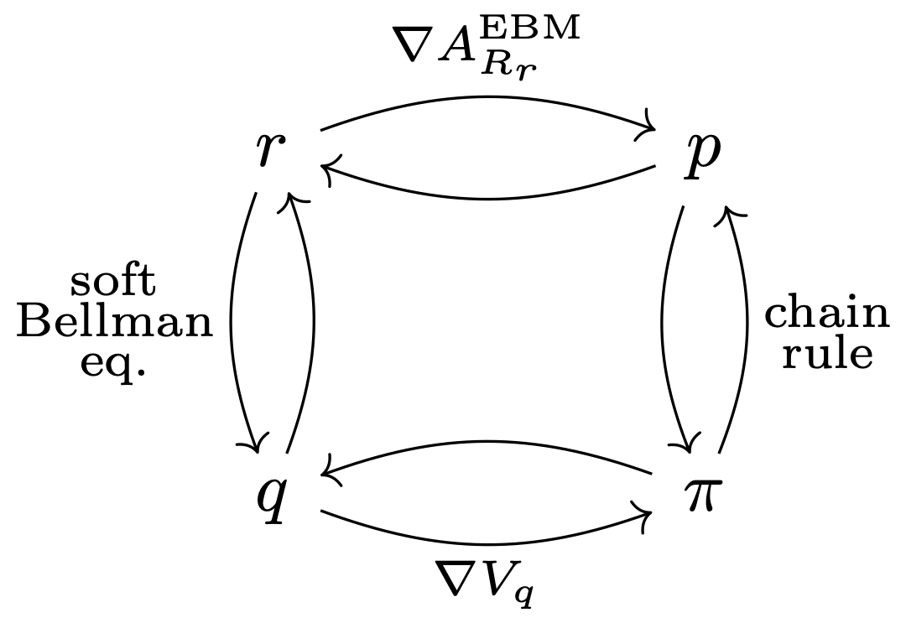
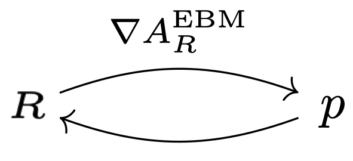
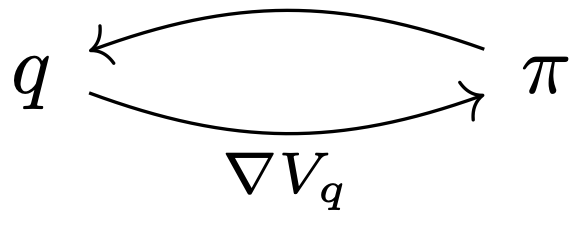
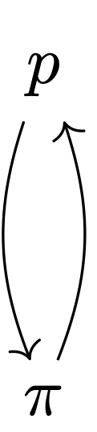
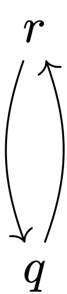
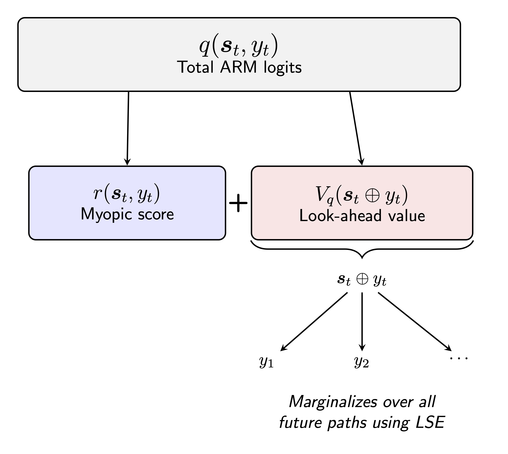
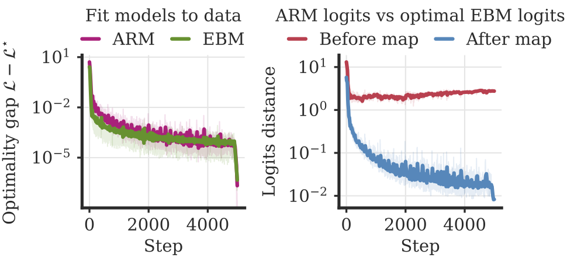

class: middle, center, title-slide

$$
\gdef\s{{\bm{s}}}
\gdef\x{{\bm{x}}}
\gdef\y{\bm{y}}
\gdef\cA{\mathcal{A}}
\gdef\cF{\mathcal{F}}
\gdef\cL{\mathcal{L}}
\gdef\cM{\mathcal{M}}
\gdef\cP{\mathcal{P}}
\gdef\cS{\mathcal{S}}
\gdef\cT{\mathcal{T}}
\gdef\cX{\mathcal{X}}
\gdef\cY{\mathcal{Y}}
\gdef\RR{\mathbb{R}}
\gdef\EE{\mathbb{E}}
\gdef\ebm{{\mathrm{EBM}}}
\gdef\arm{{\mathrm{ARM}}}
\gdef\eos{{\mathrm{EOS}}}
$$

# Autoregressive Language Models are Secretly Energy-Based Models

## Insights into the Lookahead Capabilities of Next-Token Prediction

  
<small>Mathieu Blondel, Michaël Sander, Germain Vivier-Ardisson, Tianlin Liu, Vincent Roulet</small>

---

## Introduction

* **Autoregressive models (ARMs)**

  * Despite being the **dominant** paradigm for LLMs, ARMs remain relatively poorly understood. 

  * On first sight, they appear **myopic**: they just predict one token at a time. Yet, their empirical success is astonishing!

  * During pretraining, we train to predict the next token conditioned on the ground-truth context. This is known as **teacher forcing**
    and has been criticized for introducing "exposure bias".

--

* **Energy-based models (EBMs)**

  * Another class of models, much less used in practice, since they pose significant computational challenges (difficult to train and to sample from).

--

* **This paper**

  * We use EBMs to help us better understand ARMs.

  * ARMs can perfectly fit EBMs. To do so, they need to learn the ability to **lookahead**!

  * **Teacher forcing** is optimal in function space.

---

class: middle

.center.width-75[]

.center[**Roadmap for this talk**]

---

# Outline

* Energy-based models (EBMs)
* Autoregressive models (ARMs)
* Learning from examples vs. Learning from reward functions
* Bijections: distribution space vs. logit space
* Optimality of teacher forcing

---

{{OUTLINE}}

---

class: middle

## Energy-based models (EBMs)

EBMs are sequence-level Gibbs / Boltzmann distributions
$$
p\_R^\ebm(\y|\x) \coloneqq \frac{\exp(R(\x, \y))}{\sum_{\y' \in \cY} \exp(R(\x, \y'))}
$$
$R$ scores the affinity between the prompt $\x$ and the **entire** response $\y$.

EBMs are undirected graphical models (Markov random fields).

Any $p(\y|\x) > 0$ can be written as $p^\ebm\_R(\y|\x)$. Indeed, we can just choose
$R(\x, \y) \coloneqq \log p(\y|\x)$.

---

## Pros and cons of EBMs 

* **Pros**

  * Can score the entire response given the prompt.

  * Can use bidirectional (non-causal) Transformers.

  * Have the ability to plan ahead the response.

--

* **Cons**

  * Intractable normalization constant.

  * Difficult to sample from

      * Resort to MCMC algorithms (Langevin, Gibbs)

      * Resort to gradient descent at inference time (needs soft tokens?)

  * Difficult to train from examples (log-probabilities are intractable).

---

## Sequence-level log-partition

EBMs can be rewritten as
$$
p\_R^\ebm(\y|\x)  = \exp(R(\x, \y) - A\_R^\ebm(\x))
$$
where we used the sequence-level log-partition
$$
A\_R^\ebm(\x) \coloneqq \log \sum_{\y \in \cY} \exp(R(\x, \y))
$$

 

--

The gradient of the log-partition is a mapping from $R(\x, \cdot)$ to $p(\cdot|\x)$!

.center.width-50[]

---

{{OUTLINE}}

---

## Autoregressive models (ARMs)

Autoregressive models are factorized as
$$
p^\arm\_q(\y|\x) \coloneqq \prod\_{t=1}^{|\y|} \pi\_q(y\_t | \underbrace{\x \oplus \y\_{< t}}\_{\s\_t})
$$

where

$$
\pi\_q(\y\_t | \s\_t) \coloneqq \frac{\exp(q(\s\_t, y\_t))}{\sum\_{j \in \cA} \exp(q(\s\_t, j)}
$$

$q$ scores the next token $y\_t$ given the context (prefix) $\s\_t$.

ARMs are directed graphical models (Bayesian networks).

---

## Pros and cons of ARMs 

* **Pros**

  * Easy to sample from (by ancestral sampling).

  * Easy to train from examples (log-probabilities are tractable).

* **Cons**

  * On first sight, they look myopic (next-token prediction).

  * Must causal Transformers.

---

## Token-level log-partition

The next-token distribution can be rewritten as
$$
\pi\_q(y\_t|\s\_t)  = \exp(q(\s\_t, y\_t) - V\_q(\s\_t))
$$
where we used the token-level log-partition
$$
V\_q(\s\_t) \coloneqq \log \sum_{j \in \cA} \exp(q(\s\_t, j))
$$

 

--

The gradient of the log-partition is a mapping from $q(\s\_t, \cdot)$ to $\pi(\cdot|\s\_t)$!

.center.width-50[]

---

{{OUTLINE}}

---

## Learning from prompt-response pairs (SFT)

**Expected risk of EBM**
$$
\cL^\ebm(R) \coloneqq \EE\_{(X,Y) \sim \rho} \left[-\log p^\ebm\_R(Y|X)\right]
$$
We train the model to predict the entire $\y$ given $\x$.

--

**Expected risk of ARM**
$$
\begin{aligned}
\cL^\arm(q) &\coloneqq \EE\_{(X,Y) \sim \rho} \left[-\log p^\arm\_q(Y|X)\right] \\\\
&= \EE\_{(X,Y) \sim \rho} \left[-\sum\_{t=1}^{|Y|}\log \pi\_q(Y\_t|X \oplus Y\_{< t}) \right]
\end{aligned}
$$
We train the model to predict the next token $y\_t$ based on the ground-truth
context $\s\_t = \x \oplus \y\_{< t}$ (not the context sampled so far by the
model).

This is known as **teacher forcing** (or **behavior cloning** in RL). 
However, this is a natural consequence of using the negative log-likelihood!

---

## Learning from reward functions and prompts (RL)

$$
p^\star \coloneqq \argmax\_{p \in \cP(\cY|\cX)} 
\EE\_X \EE\_{Y \sim p(\cdot|X)} \left[R(X, Y) - \mathrm{KL}(p(\cdot|X), p\_{\mathrm{ref}}(\cdot|X))\right]
$$

--

**Optimal solution of maxent RL is an EBM!**

$$
R\_{\mathrm{ref}}(\x, \y) \coloneqq \log p\_{\mathrm{ref}}(\y|\x)
$$

$$
\implies
p^\star = p^\ebm\_{R + R\_{\mathrm{ref}}}
$$

--

**Maxent RL as distilling an EBM into an ARM...**

$$
\argmin\_{q \in \cF(\cS \times \cA)} \EE\_X \mathrm{KL}(p^\ebm\_R(\cdot|X), p^\arm\_q(\cdot|X))
$$

This is the idea of **amortized sampling**. We spend some effort at train time to make sampling easier at inference time.

---

{{OUTLINE}}

---

## From next-token to sequence-level distribution, and vice-versa

.pull-right.width-50[]

* From $\pi \in \cP(\cA|\cS)$ to $p \in \cP(\cY|\cX)$ (easy direction)
$$
p(\y|\x) \coloneqq \prod\_{t=1}^{|\y|} \pi(y\_t | \x \oplus \y_{< t})
$$

--

* From $p \in \cP(\cY|\cX)$ to $\pi \in \cP(\cA|\cS)$ (difficult direction)
$$
\begin{aligned}
p(\y\_{\le t}|\x) 
&\coloneqq \sum\_{y\_{t+1} \in \cA} p(\y\_{\le t}, y\_{t+1}|\x) \\\\
\pi(y\_t|\x, \y\_{< t}) &\coloneqq \frac{p(\y\_{\le t}|\x)}{p(\y\_{\le t-1}|\x)}
\end{aligned}
$$

---

## Decomposition of R

Without loss of generality, any $R \colon \cX \times \cY \to \RR$ decomposes as
$$
R\_r(\x, \y) \coloneqq \sum\_{t=1}^{|\y|} r(\underbrace{\x \oplus \y\_{< t}}\_{\s\_t}, y\_t)
$$
where $r \colon \cS \times \cA \to \RR$

Therefore, any $p^\ebm\_R$ can be rewritten as $p^\ebm\_{R\_r}$.

---

## Bijective mapping between ARM and EBM logits

.pull-right.width-35[]

We define the mapping $q = \cM(r)$ as
$$
q(\s\_t, y\_t) \coloneqq
\begin{cases}
r(\s\_t, y\_t) &\text{if} ~ y\_t = \eos \\\\
r(\s\_t, y\_t) + V\_q(\s\_t \oplus y\_t) &\text{if} ~ y\_t \neq \eos
\end{cases}
$$
$\cM$ is bijective (i.e., $\cM^{-1}$ exists and is unique).  

--

If $q = \cM(r)$, then for all $\x \in \cX$ and $\y \in \cY$,

$$
\begin{aligned}
p^\ebm_{R_r}(\y | \x) &= p^\arm_q(\y | \x) \\
A^\ebm_{R_r}(\x) &= V_q(\x)
\end{aligned}
$$

Computational cost of explicit conversion is $O(V^T)$.

--

Another way to put this is, if $q = \cM(r)$, then for all $\x \in \cX$,
$$
\mathrm{KL}(p^\ebm\_{R\_r}(\cdot|\x), p^\arm\_q(\cdot|\x)) = 0
$$

---

## Lookahead capability of ARMs

* In an LLM setting, the selected next token $y\_t$ deterministically determine the next state $\s_{t+1} = \s\_t \oplus y\_t$.
This is the **deterministic tree MDP** setting in RL.

--

* $q(\s\_t, y\_t) = r(\s\_t, y\_t) + V\_q(\s\_t \oplus y\_t)$ is a special case of **soft Bellman equation** and
$V\_q(\s\_t) \coloneqq \log \sum_{j \in \cA} \exp(q(\s\_t, j))$ is the **soft value function**.

--

* $q$ must model the immediate local score $r$, and it must learn
to implicitly compute the future-looking soft value function $V\_q$.

.center.width-50[]

---

class: middle

.center.width-75[]

---

## Optimality of teacher forcing

Thanks to the bijective mapping $\cM$, we have

$$
\min_{q \in \cF(\cS \times \cA)} \cL^\arm(q)
= 
\min_{r \in \cF(\cS \times \cA)} 
\cL^\ebm(R_r)
= 
\min_{R \in \cF(\cX \times\cY)} 
\cL^\ebm(R)
$$

--

Suppose we obtained $q^\star$, $r^\star$, and $R^\star$ using the above minimizations. Then,
$$
p^\arm\_{q^\star}(\y|\x) = p^\ebm\_{R\_{r^\star}}(\y|\x) = p^\ebm\_{R^\star}(\y|\x)
$$

But we haven't done any explicit conversion to obtain $q^\star$!

The mapping $\cM$ is completely implicit.

---

## KL bound in the function approximation setting

For any $r \in \cF(\cS \times \cA)$ and $q \in \cF(\cS \times \cA)$

$$
\mathrm{KL}(p^\ebm_{R_r}(\cdot|\x), p^\arm_q(\cdot|\x))
\le 2T \max_{\substack{\s \in \cS(\x)\\ y \in \cA}} |q^\star(\s, y) - q(\s, y)|
$$

where $q^\star = \cM(r)$

--

From Furuya et al. (2025, Theorem 2), there exists a causal Transformer such that
$$
\max_{\substack{\s \in \cS(\x), y \in \cA}}|q^\star(\s,y)- \cT(\s)[y]|\leq \varepsilon.
$$

--

Therefore
$$
\mathrm{KL}(p^\ebm\_{R\_r}(\cdot|\x), p^\arm\_{\cT(\cdot)[\cdot]}(\cdot|\x))
\le 2T \varepsilon.
$$

---

## Numerical validation

 

.center.width-100[]

---

## Recap

* Autoregressive models inherently have the ability to **lookahead**, through the (implicitly learned) soft value function!

* Teacher forcing is **optimal** in the space of functions. 
If learning failures occur, they  must necessarily come from model approximation or optimization error!

--

## Future work

* Better understand the effect of model approximation and optimization error.

* Can we design architectures, objective functions, inductive biases
to help learn $q(\s\_t, y\_t) = r(\s\_t, y\_t) + V\_q(\s\_t \oplus y\_t)$?

* Reasoning traces (chain-of-thoughts) allow the model to perform inference-time scaling. 
How much do they help with approximating $V\_q$?
