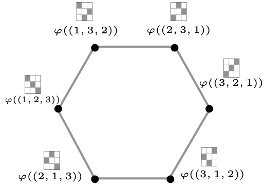
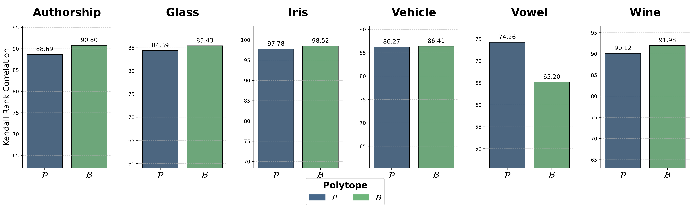

class: middle, center, title-slide

$$
\gdef\muv{\bm{\mu}}
\gdef\thetav{\bm{\theta}}
\gdef\u{{\bm{u}}}
\gdef\U{{\bm{U}}}
\gdef\v{{\bm{v}}}
\gdef\w{{\bm{w}}}
\gdef\x{{\bm{x}}}
\gdef\y{\bm{y}}
\gdef\cC{\mathcal{C}}
\gdef\cF{\mathcal{F}}
\gdef\cL{\mathcal{L}}
\gdef\cB{\mathcal{B}}
\gdef\cP{\mathcal{P}}
\gdef\cV{\mathcal{V}}
\gdef\cW{\mathcal{W}}
\gdef\cX{\mathcal{X}}
\gdef\cY{\mathcal{Y}}
\gdef\RR{\mathbb{R}}
\gdef\EE{\mathbb{E}}
\gdef\LSE{{\mathrm{LSE}}}
$$

# Joint Learning of Energy-based Models and their Partition Function

  
Michaël Sander, Vincent Roulet, Tianlin Liu, Mathieu Blondel

---

# Outline

* What are energy-based models? (EBMs)
* Inference with EBMs
* Existing approaches for learning EBMs
* Proposed approach for learning EBMs
* Experiments

---

{{OUTLINE}}

---

## Problem setup: probabilistic structured prediction

.center[**Goal:** learn a conditional probability distribution $p(\y|\x)$ over $\cY|\cX$]

$\cX$: input space  
$\cY$: combinatorially-large discrete output space
--

 

**Example: label ranking**

$\cY$ is the set of **permutations** or **permutation matrices** of $[k]$, with $|\cY| = k!$

.grid[
.kol-1-2.left.width-90[

]
.kol-1-2.center.width-90[

]
]

---

## Probabilistic energy-based models (EBMs)

Turn a function into a probability distribution without factorization assumptions.
$$
p\_g(\y|\x) \coloneqq \frac{q(\y|\x)\exp(g(\x, \y))}{\sum\_{\y' \in \cY}q(\y'|\x)\exp(g(\x, \y'))}
$$

 

$g(\x, \y)$: scalar-valued **"affinity"** function (typically a neural network).

$q(\y|\x)$: easy-to-sample **prior** distribution.

 

They define a **Gibbs / Boltzmann distribution**.

  

EBMs are also used in the unsupervised setting to learn a distribution $p\_g(\x)$.

---

{{OUTLINE}}

---

## Three inference problems

* **Mode**
$$
\x \mapsto 
\argmax\_{\y \in \cY} p\_g(\y|\x) 
= \argmax\_{\y \in \cY} q(\y|\x) g(\x, \y)
$$

 

* **Sampling**
$$
\y \sim p\_g(\cdot|\x)
$$

 

* **Mean**
$$
\x \mapsto \EE\_{\y \sim p\_g(\cdot|\x)}[\y]
\in \mathrm{conv}(\cY)
$$

 

.center[Each problem requires a specific **oracle** for a given output set $\cY$.]

---

## Computing the mode: bilinear coupling case

If $g(\x, \y) = \langle h(\x), \y \rangle$ 
and $q$ is uniform, then

 

$$
\max\_{\y \in \cY} g(\x, \y)
=
\max\_{\y \in \cY} \langle h(\x), \y \rangle
= 
\max\_{\y \in \mathrm{conv}(\cY)} \langle h(\x), \y \rangle
$$

 

This is a **linear program**. 

Dedicated oracles exist for specific $\cY$.

--

 
**Examples**

If $\cY$ is the set of permutations, we can use an **argsort**.

If $\cY$ is the set of permutation matrices, we can use the **Hungarian algorithm**.

---

## Sampling

How to sample $\y \sim p\_g(\cdot|\x)$
where
$p\_g(\y|\x) \propto q(\y|\x) \exp(g(\x, \y))$
?

--

 

Samplers are usually based on **Markov-Chain Monte-Carlo (MCMC)**.

* Continuous $\cY$: **Langevin**
* Discrete $\cY$: **Gibbs sampling**

---

{{OUTLINE}}

---

## The challenge of maximum likelihood estimation (MLE)

 

MLE is equivalent to minimizing the negative log-likelihood
$$
\cL\_{\mathrm{MLE}}(g) 
\coloneqq \EE\_{(\x,\y)} \left[-\log p\_g(\y|\x)\right]
$$

--

 

By plugging the definition of $p\_g$, we get
$$
\cL\_{\mathrm{MLE}}(g) 
= \EE\_{\x} \left[\LSE\_g(\x)\right] - \EE\_{(\x,\y)} \left[g(\x, \y)\right] + \mathrm{const}
$$
where we defined the **log-partition function** (a.k.a. **log-sum-exp**)
$$
\LSE\_g(\x) \coloneqq \log \sum_{\y' \in \cY} q(\y'|\x) \exp(g(\x,\y'))
$$

--

Efficient oracles available in some cases but **intractable in general**.

---

## Contrastive divergences

Originally proposed for **RBMs** but they can be used for **EBMs** as well.

--

Gradient of the MLE objective

$$
\nabla\_\w \cL\_{\mathrm{MLE}}(g\_\w)
= \EE\_{\x} \EE\_{\y' \sim p\_{g\_\w}(\cdot|\x)}
[\nabla\_\w g\_\w(\x, \y')] - \EE\_{(\x,\y)} \nabla\_\w g\_\w(\x, \y)
$$
Contrasts model **samples** and groud-truth samples.

--

 

Sampling from $p\_{g\_\w}(\cdot|\x)$ often requires **MCMC** as we saw.

 

Truncated MCMC leads to **biased gradients**.

---

## Generalized perceptron losses

$$(\x, \y) \mapsto 
\max_{\muv \in \cC} g(\x, \muv) - g(\x, \y)$$

where $\cC$ is a convex superset of $\cY$, for example, $\cC = \mathrm{conv}(\cY)$.

Contrasts model **mode** and groud-truth samples.

--

**Advantages**

They circumvent the need for computing the log-partition.

Gradients are easy to compute thanks to envelope theorems.

--

**Disadvantage**

They do not learn a probabilistic model, only the relaxed argmax.

$$
\x \mapsto \argmax_{\muv \in \cC} g(\x, \muv)
$$

---

## Min-max formulation

**Variational formulation** of the log-sum-exp for all $\x \in \cX$
$$
\LSE\_g(\x)
= \max\_{p \in \cP(\cY|\x)} \EE_{\y \sim p(\cdot|\x)} \left[g(\x, \y)\right] - \mathrm{KL}(p(\cdot|\x),q(\cdot|x))
$$

--

 

By plugging this formulation in the MLE objective, we obtain 
$$
\min\_{g \in \cF(\cX \times \cY)}
\max\_{p \in \cP(\cY|\cX)}
\EE\_\x \EE\_{\y' \sim p(\cdot|\x)}[g(\x, \y')] - \EE\_{(\x,\y)}[g(\x, \y)] - \mathrm{KL}(p, q)
$$

 
Gradients w.r.t. the parameters of $p$ often use the **score function estimator** (REINFORCE),
which is known to suffer from **high variance**

---

{{OUTLINE}}

---

## <u>Another</u> variational formulation of the log-sum-exp

 

$$
\LSE\_g(\x)
=
\min\_{\tau \in \RR}
\tau + \EE\_{\y' \sim q(\cdot|\x)} \left[ \exp(g(\x, \y') - \tau) - 1\right]
$$
--

 

$\tau$ is the **Lagrange multiplier** associated with the constraint for $\x \in \cX$
$$
\sum_{\y \in \cY} p\_g(\y|\x) = 1
$$
--

 
The optimal variable **exactly coincides** with the log-partition
$$
\tau^\star = \LSE\_g(\x)
$$

---

## Proposed min-min objective

By plugging the variational form in the MLE objective, we obtain

 

$$
\min\_{g \in \cF(\cX \times \cY)}
\min\_{\tau \in \cF(\cX)}
\EE\_\x \left[\tau(\x) + \EE\_{\y' \sim q(\cdot|\x)} \left[ \exp(g(\x, \y') - \tau(\x)) - 1\right]\right] - \EE\_{(\x,\y)}[g(\x, \y)]
$$

 
One Lagrange multiplier for **each** $\x \in \cX$ .smaller[⇒] $\tau$ is a **function** from $\cX$ to $\RR$!

--

We are treating the log-partition as an **optimization variable** rather than as a quantity to compute.

 
--
**Recovers the MLE solution**

$$
\begin{aligned}
\LSE\_{g^\star}(\x) &= \tau^\star(\x)  \\\\
p\_{g^\star}(\y|\x) &= q(\y|\x) \exp(g^\star(\x,\y) - \tau^\star(\x))
\end{aligned}
$$

---

## Parameterisation and doubly stochastic gradient estimator

The previous formulation was in **function space**.

In practice, we optimize in **parameter space**.

$$
\min\_{\w \in \cW}
\min\_{\v \in \cV}
\EE\_\x \left[\tau\_\v(\x) + \EE\_{\y' \sim q(\cdot|\x)} \left[ \exp(g\_\w(\x, \y') - \tau\_v(\x)) - 1\right]\right] - \EE\_{(\x,\y)}[g\_\w(\x, \y)]
$$

Both $g$ and $\tau$ are scalar-valued **neural networks**.

 
--
**Doubly stochastic gradient estimator**

* Samples $(\x, \y)$ from the data distribution
* Samples $\y'$ from the prior distribution $q(\cdot|\x)$

Unbiased! 

---

class: middle

.center.width-100[]

.center[Convergence of the proposed method compared to exact MLE   on a multi-label task with $2^{174}$ configurations.]

---

## Generalization ability of the learned log-partition

In practice we parameterize $\tau\_\v(\x)$ as a neural network with parameters $\v \in \cV$.

We have $\tau\_\v(\x) \approx \LSE\_{g\_\w}(\x)$ on training points $\x$.

--

How about on **unseen points** $\x$?

--

 

.center.width-100[]

.center[Generalization ability of the learned log-partition   on $100$ unseen $\x$ points   in multi-label tasks.]

---

## Generalization to f-divergences

Recall that
$$
p\_g(\y|\x) \coloneqq \frac{q(\y|\x)\exp(g(\x, \y))}{\sum\_{\y' \in \cY}q(\y'|\x)\exp(g(\x, \y'))}
$$
--

This is equivalent to
$$
p\_g(\cdot|\x) = \argmax\_{p \in \cP(\cY|\x)} \EE\_{\y \sim p(\cdot|\x)}[g(\x, \y)] - \mathrm{KL}(p(\cdot|\x), q(\cdot|\x))
$$
--

 

Our approach easily generalizes to learning distributions of the form
$$
p\_g^f(\cdot|\x) 
\coloneqq 
\argmax\_{p \in \cP(\cY|\x)} \EE\_{\y \sim p(\cdot|\x)}[g(\x, \y)] - D_f(p(\cdot|\x), q(\cdot|\x))
$$
where $D\_f$ is an **f-divergence**.

---

{{OUTLINE}}

---

## Label ranking

**Permutahedron:** oracle is an argsort
$$
\begin{aligned}
&\thetav \coloneqq h(\x) \in \RR^k \\\\
&\thetav \mapsto \argmax\_{\y \in \cP} \langle \thetav, \y \rangle
\end{aligned}
$$

--

**Birkhoff polytope:** oracle is the Hungarian algorithm

$$
\begin{aligned}
&\thetav \coloneqq h(\x) \in \RR^{k \times k} \\\\
&\thetav \mapsto \argmax\_{\y \in \cB} \langle \thetav, \y \rangle
\end{aligned}
$$

.grid[
.kol-1-2.left.width-90[

]
.kol-1-2.center.width-90[

]
]

---

## Label ranking: loss comparison

  

.center.width-100[]

---

## Label ranking: model comparison

  

.center.width-100[]

---

## Take aways

- **Dualize then parameterize** (and not the opposite).

  * This makes strong duality work.

--

- Treat an **intractable quantity** (the log-partition) as an **optimization variable** (Lagrange multiplier)

  * The Lagrange multiplier $\tau(\x)$ corresponds to the equality constraint 
$$
\sum_{\y \in \cY} p\_g(\y|\x) = 1.
$$

  * In practice, since we do not reach the optimal Lagrange multiplier, this amounts to relaxing the equality constraint.

--

- **Parameterize** the Lagrange multiplier (dual variable) as a **neural network**.

  * This is an approximation to optimizing over the space of functions.

  * This allows us to approximate the log-partition on unseen $\x$ points.
